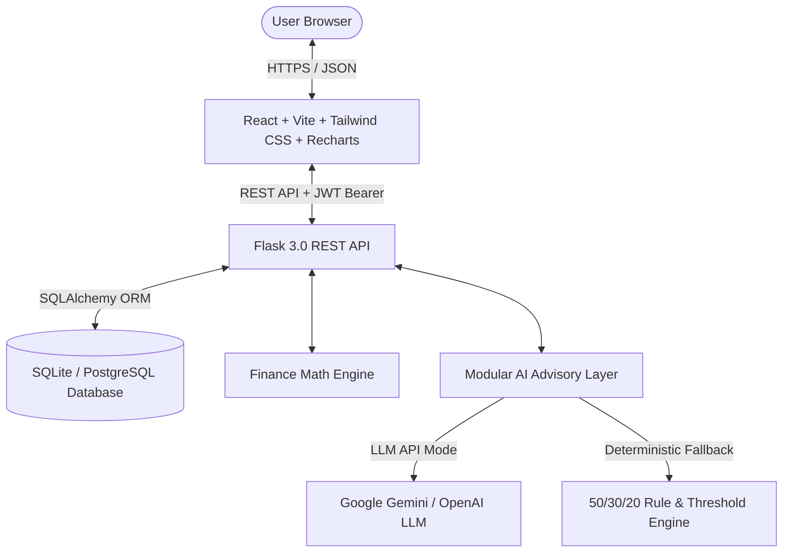

# Personal Finance Advisor Bot 💰🤖
> An AI-Powered Personal Finance & Budget Management Web Application tailored for Indian Professionals, Students, Freelancers, and Households.

[](https://www.python.org/)
[](https://flask.palletsprojects.com/)
[](https://react.dev/)
[](https://vitejs.dev/)
[](https://tailwindcss.com/)
[](https://opensource.org/licenses/MIT)

---

## 1. Introduction & Problem Statement

Managing personal finances is one of the most critical life skills, yet many individuals struggle with:
- **Lack of Visibility**: Unstructured spending across multiple UPI apps, credit cards, and cash.
- **Budget Blowouts**: Overspending on discretionary wants without real-time tracking or warnings.
- **Low Savings Discipline**: Inability to identify how much to allocate towards an Emergency Fund or target goals.
- **Absence of Objective Advice**: Financial planning tools are often either too complex (enterprise ERPs) or purely passive spreadsheets with zero intelligent guidance.

The **Personal Finance Advisor Bot** solves this by providing a unified, full-stack personal finance cockpit that pairs intuitive income/expense tracking with **hybrid AI analysis** (rule-based intelligence + LLM contextual advice) formatted natively in **Indian Rupees (₹)**.

---

## 2. Key Objectives

1. **Secure Access**: JWT-based authentication with bcrypt-grade password hashing.
2. **Comprehensive Cash Flow Tracking**: Multi-stream income recording and granular expense categorization.
3. **Dynamic Budget Management**: Monthly limits with automated utilization bars and overspend alerts.
4. **Smart 50/30/20 Budget Generator**: Personalized budget recommendations anchored in actual spending habits.
5. **Contextual AI Chatbot & Advisor**: Answers money queries strictly using real-time database figures.
6. **Financial Health Index (0–100)**: Transparent metric calculated from savings ratios and budget discipline.
7. **Month-over-Month Reporting**: Executive summaries and printer-friendly PDF statements.

---

## 3. System Architecture



### Decoupled Service Architecture:
- **Frontend SPA**: React 18 with Vite, Lucide icons, Recharts for responsive SVG visualization, and modular contexts.
- **Backend API**: Python Flask with clean Blueprint routing, centralized error handlers, and token authentication.
- **Data Persistence**: SQLAlchemy ORM with foreign keys and cascading deletes.
- **AI Dual-Engine**: Runs 100% reliably out of the box using our deterministic financial reasoning rules, with seamless Google Gemini / LLM connectivity if an API key is provided.

---

## 4. Features & Capabilities

| Module | Features |
| :--- | :--- |
| **Authentication** | Registration, Login, Current User (`/api/auth/me`), Profile management, Persona customization. |
| **Income Tracker** | Multi-source inflows (Salary, Freelance, Business, Dividends, Allowance), date & source filters. |
| **Expense Tracker** | 14+ standard Indian categories (Food, Rent, Groceries, Transport, Bills, EMIs), UPI/Card/Cash methods, search & sorting. |
| **Budget Manager** | Category limits per month/year, remaining balance, percentage used, overspend alert triggers. |
| **AI Budget Generator** | Auto-allocates 50% Needs, 30% Wants, 20% Savings adjusted by user's actual transaction history. |
| **Financial Goals** | Target amounts, progress bars, deadline countdowns, 1-click fund deposits. |
| **AI Advisor & Audit** | Detects category overspending (>30% discretionary), month-over-month expense spikes, savings rate warnings. |
| **AI Chatbot** | Real-time chat assistant answering questions with exact numbers from the user's database. |
| **Monthly Reports** | Printable executive statements, category breakdown percentages, budget adherence, and MoM deltas. |

---

## 5. Technology Stack

- **Backend**:
  - Python 3.11+
  - Flask 3.0.3 & Flask-CORS
  - Flask-SQLAlchemy 3.1.1 (ORM)
  - PyJWT 2.8.0 (JSON Web Tokens)
  - Werkzeug 3.0.3 (Secure password hashing)
  - Pytest 8.2.1 (Automated backend test suite)
- **Frontend**:
  - React 18.3 & React Router DOM 6.23
  - Vite 5.2 (Fast build tool)
  - Tailwind CSS 3.4 (Custom financial theme tokens)
  - Recharts 2.12 (Interactive Bar, Donut, and Area charts)
  - Lucide React (Crisp UI iconography)
  - Axios (HTTP client with JWT interceptors)
- **Database**:
  - SQLite (Default zero-config local database)
  - PostgreSQL ready (configured simply by altering `DATABASE_URL`)

---

## 6. Database Schema Design

```
+--------------------+       +--------------------+       +--------------------+
|       users        | 1   * |      incomes       |       |      expenses      |
|--------------------|-------|--------------------|       |--------------------|
| id (PK)            |       | id (PK)            |       | id (PK)            |
| name               |       | user_id (FK)       |       | user_id (FK)       |
| email (Unique)     |       | amount             |       | amount             |
| password_hash      |       | source             |       | category           |
| persona            |       | income_type        |       | payment_method     |
| currency           |       | date               |       | date               |
+--------------------+       +--------------------+       +--------------------+
          | 1                          | 1                          | 1
          | *                          | *                          | *
+--------------------+       +--------------------+       +--------------------+
|      budgets       |       |  financial_goals   |       |  ai_conversations  |
|--------------------|       |--------------------|       |--------------------|
| id (PK)            |       | id (PK)            |       | id (PK)            |
| user_id (FK)       |       | user_id (FK)       |       | user_id (FK)       |
| category           |       | goal_name          |       | role               |
| monthly_limit      |       | target_amount      |       | content            |
| month, year        |       | current_amount     |       | created_at         |
+--------------------+       +--------------------+       +--------------------+
```

---

## 7. Demo Account Credentials

For instant demonstration and evaluation without manually registering, use the pre-seeded account:

- **Email**: `demo@financebot.com`
- **Password**: `Demo@123`
- **Pre-populated with**:
  - Incomes: Salary (₹52,000), Freelance UI/UX (₹12,500), Stock Dividends (₹2,800).
  - Categorized Expenses: Rent (₹16,000), Groceries (₹7,400), Food & Dining (₹5,850), Transport (₹3,200), Utilities (₹2,450), Shopping (₹4,800), etc.
  - Active Budgets: Food (₹5,000 limit -> **exceeded by ₹850**), Shopping (₹3,500 limit -> **exceeded by ₹1,300**).
  - Goals: 6-Month Emergency Fund (₹1,50,000), M-Series Laptop (₹85,000), Goa Holiday (₹30,000).
  - 6 months of historical trend data.

---

## 8. Installation & Setup Guide

### Prerequisites
- Python 3.11+
- Node.js 18+ and npm

### 1. Clone & Set Up Backend

```bash
# Navigate to project directory
cd "ai loan eligibity checker"

# (Optional) Create and activate virtual environment
python -m venv venv
# On Windows:
.\venv\Scripts\activate
# On Linux/macOS:
source venv/bin/activate

# Install backend dependencies
pip install -r backend/requirements.txt

# Seed the database with demo data
python backend/seed.py

# Run the Flask backend (starts on http://127.0.0.1:5000)
python backend/run.py
```

### 2. Set Up & Run Frontend

Open a second terminal window:

```bash
# Navigate to frontend folder
cd frontend

# Install frontend dependencies
npm install

# Start Vite development server (starts on http://localhost:5173)
npm run dev
```

Visit **`http://localhost:5173`** in your browser!

---

## 9. Environment Variables (`.env`)

Create a `.env` file in the root directory or copy `.env.example`:

```ini
# Flask Secret Key
SECRET_KEY=your_super_secret_key_here

# JWT Signature Secret
JWT_SECRET_KEY=your_jwt_secret_key_here

# Database URI (SQLite default)
DATABASE_URL=sqlite:///backend/finance.db

# Optional External AI API Key (Gemini or OpenAI compatible)
# Leave blank to use the built-in Rule-Based Advisor engine!
AI_API_KEY=

# Server Settings
PORT=5000
FLASK_DEBUG=True
```

---

## 10. REST API Summary

### Authentication
- `POST /api/auth/register` - Create new user account
- `POST /api/auth/login` - Authenticate and retrieve JWT token
- `POST /api/auth/logout` - Invalidate session
- `GET  /api/auth/me` - Retrieve current user profile
- `PUT  /api/auth/profile` - Update persona, name, or password

### Cash Flow & Budgets
- `GET    /api/income` - List incomes (filters: month, year, source)
- `POST   /api/income` - Add income inflow
- `PUT    /api/income/<id>` - Modify income
- `DELETE /api/income/<id>` - Delete income record
- `GET    /api/expenses` - List expenses (filters: month, year, category, search, sorting)
- `POST   /api/expenses` - Record expense outflow
- `PUT    /api/expenses/<id>` - Modify expense
- `DELETE /api/expenses/<id>` - Delete expense record
- `GET    /api/budgets` - Get category budget limits with spent & remaining calculations
- `POST   /api/budgets` - Create or update monthly budget limit
- `POST   /api/budgets/batch` - Save AI-generated budget recommendations in bulk

### Goals & Dashboard
- `GET    /api/goals` - List active financial goals with progress percentage
- `POST   /api/goals` - Create goal
- `PATCH  /api/goals/<id>/progress` - Add funds to a goal
- `DELETE /api/goals/<id>` - Remove goal
- `GET    /api/dashboard/summary` - Aggregated income, expenses, savings, savings rate & health score
- `GET    /api/dashboard/category-breakdown` - Donut chart category distribution
- `GET    /api/dashboard/monthly-trend` - 6-month historical trend
- `GET    /api/reports/monthly` - Full monthly report snapshot

### AI Intelligence
- `POST /api/ai/analyze` - Run full spending audit and return alerts & recommendations
- `POST /api/ai/chat` - Chatbot conversation grounded in user's financial records
- `POST /api/ai/generate-budget` - Generate smart 50/30/20 budget allocations

---

## 11. Automated Testing

To run the backend test suite:

```bash
pytest backend/tests/test_api.py -v
```

**Test Coverage Highlights**:
- User registration, login, duplicate check, JWT security.
- Income & expense validation (prevention of negative values).
- Budget limits, overspending detection, and adherence ratios.
- Savings calculation safe zero-division handling.
- Deterministic AI fallback and 50/30/20 budget generator.
- Financial goal progress increments.

---

## 12. Life Scenario Walkthroughs

The application natively supports 4 distinct user profiles:

1. **Salaried Professional**:
   - Manages steady corporate paycheck (e.g. ₹50,000).
   - Monitors fixed obligations (Rent, EMIs) to keep them <50% of earnings.
   - Enforces 20%+ monthly savings rate.
2. **College Student**:
   - Manages fixed monthly pocket allowance (e.g. ₹10,000).
   - Highlights food delivery and recharge expenses.
   - Recommends micro-savings for semester goals (e.g. New Laptop).
3. **Freelancer**:
   - Tracks fluctuating multi-source invoice inflows.
   - Detects monthly variances and advises on maintaining a 6-month buffer.
4. **Household Manager**:
   - Consolidates groceries, medical checkups, utility bills, and children's education.
   - Detects bulk grocery inflation and family holiday budgeting.

---

## 13. Future Scope

- **Bank Account Integration**: Account Aggregator (AA) framework integration for automated transaction sync.
- **SMS Transaction Parsing**: Auto-reading bank debit/credit SMS alerts on mobile.
- **Receipt OCR**: Image scanning of physical bills and grocery invoices.
- **Predictive Spending Forecasts**: Machine learning regression models predicting end-of-month cash balances.
- **Investment Recommendations**: Asset allocation guidance into index funds and sovereign gold bonds.
- **Voice Assistant**: Natural language voice queries in English and Hindi.

---

## 14. Disclaimer

*AI-generated suggestions and financial health metrics provided by this application are for educational and personal planning purposes only and should not be considered professional, tax, legal, or regulated financial advice.*
